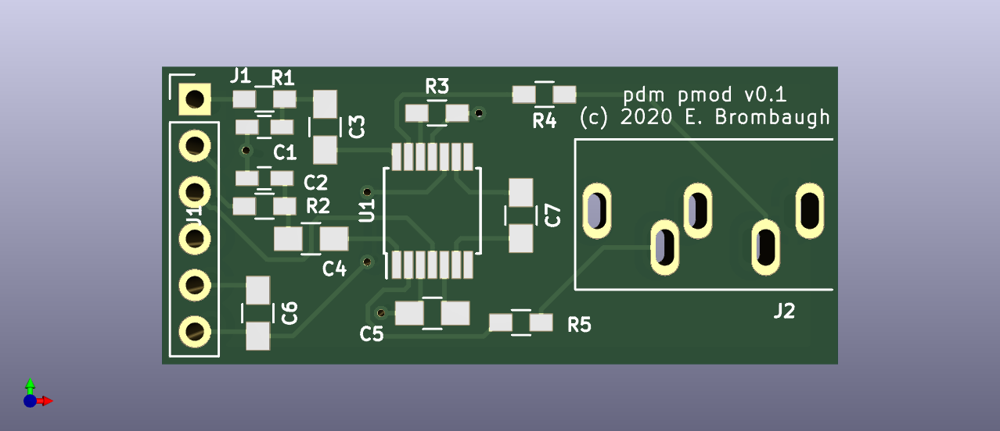

# pdm_pmod
A stereo headphone driver using Pulse Density Modulation

## Abstract
This project was built as a quick test to check out the concept of a PDM audio
output through a low-voltage headphone driver prior to using it in some more
complex projects. It's a small and simple 4-bit PMOD that won't use up a lot of
your FPGA devboard's I/O and still provides decent-quality stereo audio when
used in conjunction with a low-complexity PMOD gateware which can be found in
other projects in my github account:

## Hardware
The hardware design is provided as schematic and layout in KiCAD 6 format.
The design provides:
* Single-row (4-bit, 6-pin) PMOD connector.
* Stereo 3.5mm TRS headphone jack.

## Gateware
A PDM stereo driver compatible with this can be found here:

https://github.com/emeb/orangecrab_adc/blob/master/gateware/verilog/src/pdm_dac.v